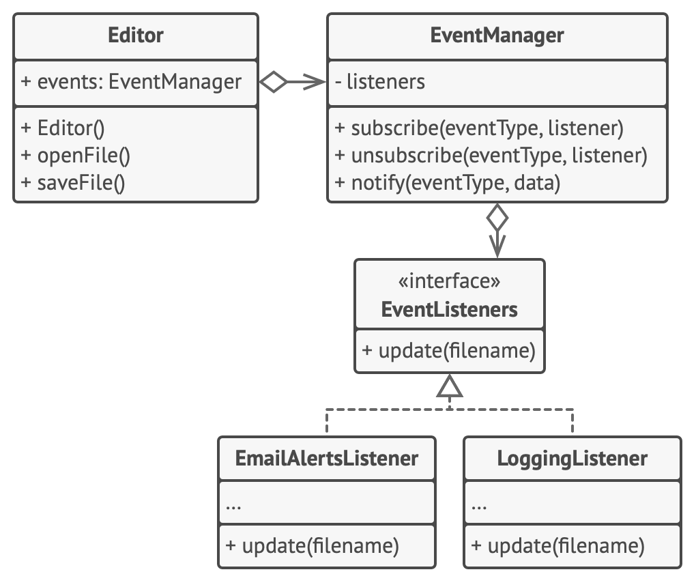

## Descripción del Patrón de Diseño Observer

El patrón de diseño Observer es un patrón de comportamiento que establece una dependencia uno-a-muchos entre objetos. Permite que un objeto (conocido como Subject o Sujeto) notifique automáticamente a un grupo de objetos dependientes (denominados Observers u Observadores) sobre cualquier cambio en su estado, sin que esos objetos estén estrechamente acoplados.

### Estructura del Patrón

**Subject (Sujeto):** Mantiene una lista de observadores y proporciona métodos para añadirlos o eliminarlos. Notifica a todos los observadores registrados cuando se produce un cambio en su estado.

**Observer (Observador):** Define una interfaz que los objetos observadores deben implementar. Contiene el método update(), que es llamado por el sujeto para actualizar el estado del observador.

**ConcreteSubject (Sujeto Concreto):** Implementa la interfaz del sujeto y gestiona el estado que interesa a los observadores. Cuando cambia su estado, llama al método notifyObservers().

**ConcreteObserver (Observador Concreto):** Implementa la interfaz del observador y actualiza su estado en función de las notificaciones recibidas del sujeto.
Tenemos asi que nuestra Clase Emisora es el sujeto, pues esta permite agregar nuevos suscriptores o eliminarlos.

El patrón Observer sugiere que añadas un mecanismo de suscripción a la clase notificadora para que los objetos individuales puedan suscribirse o cancelar su suscripción a un flujo de eventos que proviene de esa notificadora. ¡No temas! No es tan complicado como parece. En realidad, este mecanismo consiste en: 1) un campo matriz para almacenar una lista de referencias a objetos suscriptores y 2) varios métodos públicos que permiten añadir suscriptores y eliminarlos de esa lista.

Ahora, cuando le sucede un evento importante al notificador, recorre sus suscriptores y llama al método de notificación específico de sus objetos.

Las aplicaciones reales pueden tener decenas de clases suscriptoras diferentes interesadas en seguir los eventos de la misma clase notificadora. No querrás acoplar la notificadora a todas esas clases. Además, puede que no conozcas algunas de ellas de antemano si se supone que otras personas pueden utilizar tu clase notificadora.

Por eso es fundamental que todos los suscriptores implementen la misma interfaz y que el notificador únicamente se comunique con ellos a través de esa interfaz. Esta interfaz debe declarar el método de notificación junto con un grupo de parámetros que el notificador puede utilizar para pasar cierta información contextual con la notificación.

### Diagrama Uml del Patrón en este repositorio:

Ahora bien, para el ejercicio propuesto en este repositorio, hemos creado una interfaz llamada **_Receptor_**, la cual implementan todos los **_receptores concretos_** llamada **_Receptor_** la cual obliga a implementar en todos ellos el respectivo método **recibe()**. También he creado una Clase llamada **_Emisora,_** la cual tiene tiene dos métodos en este caso, llamados: **addReceptor** el cual ingresa el receptor en un Arraylist interno y el otro método llamado **emite()** mediante el cual recorreremos ese ArrayList e invocará el método recibe de cada receptor que esté en ese ArrayList.

Razón por la cual, este método o patrón también es llamado **_public suscribe_**, ya que uno publica o emite en éste caso y los otros se suscriben a esas publicaciones para reaccionar ante un evento. Un ejemplo tipico en el mundo real es que tengamos un sistema de registro de usuarios así mediante el patrón Observer cuando alguno se registre, mandaremos una señal por ejemplo al subsistema de base de datos o al sistema de registro, para tener la notificación, de que algo ha pasado o incluso podemos tener también un sistema de notificaciones por correo que estaría suscrito a lo que ha pasado y cómo se van disparando uno y otro y otro en orden pues por ejemplo primero se dispararía notificación por email, despues se dispararía el log, despues se dispararía el registro en base de datos etc.

De modo que emitimos y automáticamente los receptores que implementan el método que hemos definido en nuestra interfaz van a actuar en consecuencia.

Nota: “Este patrón se utiliza mucho y es realmente útil.”

Gran parte de lo que hacemos en el Patrón observer es parte de lo que ya hemos hecho en el iterator, lo que pasa es que no es tan visible. Sin embargo si nos fijamos, cuando invocamos al método emite() también estamos recorriendo la lista y es más podría incluso implementar el patrón iterator dentro del patrón observer. Recordando además, que podemos implementar varios patrones en uno.

**_Imagen de ejecución por consola:_**

**Flujo del Patrón Observer**

1. El sujeto almacena una lista de observadores o Receptores quienes se suscriben (Radio, Tv, Satelite).
2. Los observadores se registran (o se eliminan) usando los métodos addReceptor() y delReceptor().
3. Cuando el estado del sujeto cambia, este invoca notify(), que recorre la lista de observadores y llama al método update() en cada uno de ellos.
Los observadores actualizan su estado en función de la notificación recibida.
Ventajas
Desacoplamiento entre el sujeto y sus observadores.
Flexibilidad para agregar o eliminar observadores sin modificar la clase principal.
Desventajas
El orden en que los observadores son notificados no está garantizado.
Puede haber problemas de rendimiento si hay demasiados observadores.

## Estructura

## Pseudocódigo

Imagenes tomadas de: https://refactoring.guru/es/design-patterns/observer
